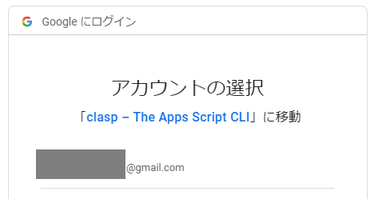
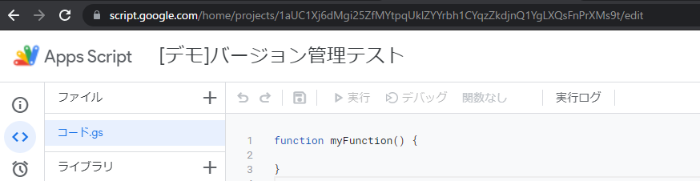
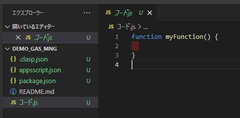
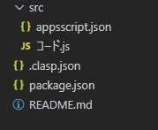
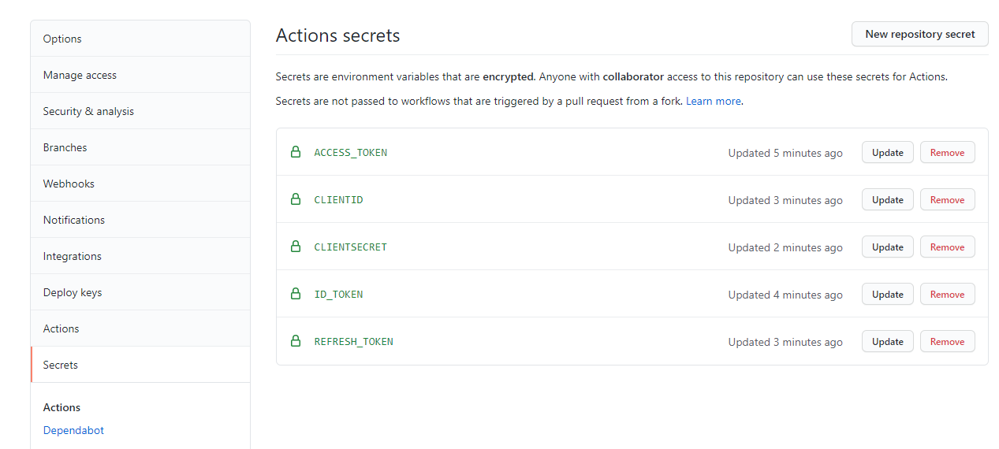
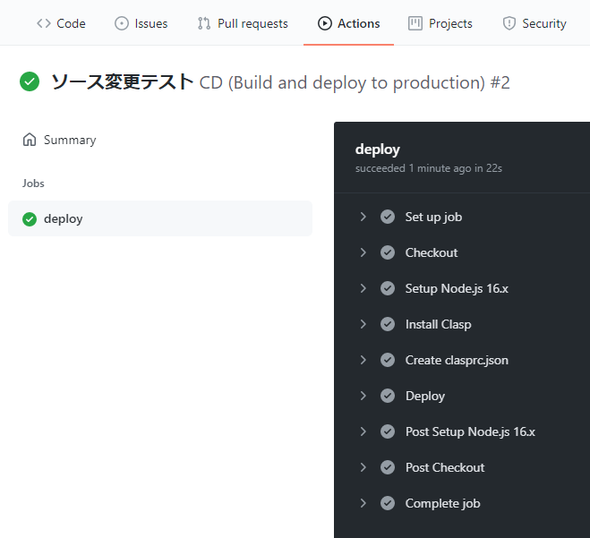
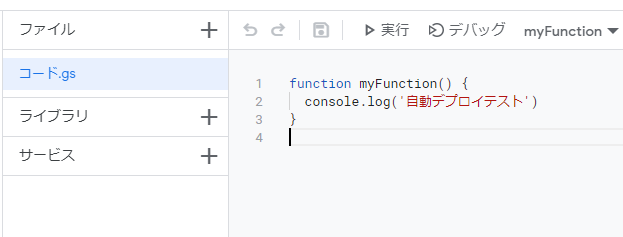

# demo_gas_mng
GASのバージョン管理を行うサンプルリポジトリ

## 参考
[GASのバージョン管理の課題とGoogle Apps Script GitHub アシスタントができること](https://tonari-it.com/gas-github-assistant-introduction/)

[GitHub Actionsを使ってGASをデプロイしてみた | DevelopersIO](https://dev.classmethod.jp/articles/github-actions-gas-deploy/)

## 手順

### リポジトリの準備
+ GitHubにてリポジトリを作成
+ リポジトリをclone
+ cloneしたディレクトリに移動
```bash
C:\Users\ryub\product>git clone git@github.com:RyuB411/demo_gas_mng.git
Cloning into 'demo_gas_mng'...
~中略~
Receiving objects: 100% (3/3), done.

C:\Users\ryub\product>cd demo_gas_mng
```

### npm,claspのインストール
+ npm initコマンドを打ってNode.jsなどインストール
設定は全てデフォルトで問題無し
```bash
C:\Users\ryub\product\demo_gas_mng>npm init
This utility will walk you through creating a package.json file.
~中略~
{
  "name": "demo_gas_mng",
  "version": "1.0.0",
  "description": "",
  "main": "index.js",
  "scripts": {
    "test": "echo \"Error: no test specified\" && exit 1"
  },
  "repository": {
    "type": "git",
    "url": "git+https://github.com/RyuB411/demo_gas_mng.git"
  },
  "author": "",
  "license": "ISC",
  "bugs": {
    "url": "https://github.com/RyuB411/demo_gas_mng/issues"
  },
  "homepage": "https://github.com/RyuB411/demo_gas_mng#readme"
}


Is this OK? (yes) yes

C:\Users\ryub\product\demo_gas_mng>
```

+ node, npmがインストールされている事を確認
+ google/claspをインストール
```bash
C:\Users\ryub\product\demo_gas_mng>node --version
v14.16.1

C:\Users\ryub\product\demo_gas_mng>npm --version
6.14.12

C:\Users\ryub\product\demo_gas_mng>npm i @google/clasp -g
~中略~
+ @google/clasp@2.4.1
added 1 package from 1 contributor and updated 9 packages in 11.395s

C:\Users\ryub\product\demo_gas_mng>
```

### Google Apps Script側の設定
#### Google Apps Script APIを有効にする
+ Google Apps Scriptのプロジェクト画面にアクセス
+ 左メニューの「設定」を選択
+ 「Google Apps Script API」を選択
+ オンに切り替える


### claspの設定
#### claspでログイン
+ コマンドにて、claspのログインを実行
```bash
C:\Users\ryub\product\gas_control_demo>clasp login
Logging in globally…
🔑 Authorize clasp by visiting this url:
~中略~
```
+ clasp loginコマンド実行後、ブラウザが開き
clasp-Googleアクセス許可画面が表示されるので、ログインして許可する。  



+ 許可した後、ブラウザでは下記メッセージが開かれれば成功。画面は閉じる  
```
Logged in! You may close this page. 
```

+ コマンド側も以下の通り結果が出力される
```bash
Authorization successful.

Default credentials saved to: C:\Users\ryub\.clasprc.json.
```

+ 最後に出力された.clasprc.jsonのファイルは、後ほど参照するので控えておく

#### Googleスクリプトのプロジェクトをクローン
+ クローンしたいスクリプトのプロジェクトIDを控える
プロジェクトにアクセスした際のURLのうち、末尾の英数字
以下の場合、「1aUC1Xj6dMgi25ZfMYtpqUklZYYrbh1CYqzZkdjnQ1YgLXQsFnPrXMs9t」


+ コマンドにて、 clasp clone [プロジェクトID] を実行する
```bash
C:\Users\ryub\product\demo_gas_mng>clasp clone 1aUC1Xj6dMgi25ZfMYtpqUklZYYrbh1CYqzZkdjnQ1YgLXQsFnPrXMs9t
Warning: files in subfolder are not accounted for unless you set a 'C:\Users\ryub\product\demo_gas_mng\.claspignore' file.
Cloned 2 files.
└─ C:\Users\ryub\product\demo_gas_mng/appsscript.json
└─ C:\Users\ryub\product\demo_gas_mng/コード.js
~中略~

C:\Users\ryub\product\demo_gas_mng>
```

+ 対象のGASプロジェクトが設置される。


#### ファイル構成の設定
プロジェクト全体の設定と切り分けるため、ソースコードはsrcフォルダに設置するよう変更
+ 作成された.clasp.jsonを開く
+ rootDirの値を"./src"に変更する
```
{"scriptId":"xxxx","rootDir":"./src"}
```
+ srcディレクトリを作成し、その中にappsscript.jsonとGoogleスクリプトのファイルを移動する


#### デプロイ可能か確認
+ コマンドにて、clasp pushを実行
ファイル情報を更新してよいか聞かれる場合はyesを選択
```
C:\Users\ryub\product\demo_gas_mng>clasp push
? Manifest file has been updated. Do you want to push and overwrite? Yes
└─ src/appsscript.json
└─ src/コード.js
Pushed 2 files.
```
+ 元のGoogle Apps Scriptが変更されていれば成功

### GitHub Actionsの設定
上記の通り、clasp pushコマンドで元のGASファイルに内容を反映させられる。
以下手順では、GitHubにpushしたタイミングでclasp pushコマンドも実行するよう設定する。

#### GitHubのSecretsを設定
+ 先ほど控えていた.clasprc.jsonの中身を開く

※見やすくするため改行していますが、実際は1行で書かれています。
```json
{
    "token":{
        "access_token":"xxxxxx",
        "refresh_token":"xxxxxx",
        "scope":"xxxxxx",
        "token_type":"Bearer",
        "id_token":"xxxxxx",
        "expiry_date":1628512345678
    },
    "oauth2ClientSettings":{
        "clientId":"xxxxxxxx.apps.googleusercontent.com",
        "clientSecret":"xxxxxxxx",
        "redirectUri":"http://localhost"
        },
    "isLocalCreds":false
}
```

+ このうち、以下項目をリポジトリのSecretに入れる。
  + access_token
  + refresh_token
  + id_token
  + client_id
  + client_secret



#### ワークフローファイルの作成
+ 以下ディレクトリ・ファイルを作成する
  .github/workflows/cd.yml

+ 作成したファイルに、以下の通り記載する

```yml
name: CD (Build and deploy to production)

on:
  push:
    branches:
      - main
  workflow_dispatch:
jobs:
  deploy:
    runs-on: ubuntu-20.04
    timeout-minutes: 15
    steps:
      - name: Checkout
        uses: actions/checkout@v2
      - name: Setup Node.js 16.x
        uses: actions/setup-node@v2
        with:
          node-version: '16.x'
      - name: Install Clasp
        run: |
          npm init -y
          npm install clasp -g
      - name: Create clasprc.json
        run: |
          echo \{\"token\":\{\"access_token\":\"${{ secrets.ACCESS_TOKEN}}\",\"scope\":\"https://www.googleapis.com/auth/userinfo.email https://www.googleapis.com/auth/drive.metadata.readonly https://www.googleapis.com/auth/script.projects https://www.googleapis.com/auth/script.webapp.deploy https://www.googleapis.com/auth/logging.read openid https://www.googleapis.com/auth/userinfo.profile https://www.googleapis.com/auth/drive.file https://www.googleapis.com/auth/script.deployments https://www.googleapis.com/auth/service.management https://www.googleapis.com/auth/cloud-platform\",\"token_type\":\"Bearer\",\"id_token\":\"${{ secrets.ID_TOKEN }}\",\"expiry_date\":1620870307822,\"refresh_token\":\"${{ secrets.REFRESH_TOKEN }}\"\},\"oauth2ClientSettings\":\{\"clientId\":\"${{ secrets.CLIENTID }}\",\"clientSecret\":\"${{ secrets.CLIENTSECRET }}\",\"redirectUri\":\"http://localhost\"\},\"isLocalCreds\":false\} > ~/.clasprc.json
      - name: Deploy
        run: |
          clasp push
        #   clasp deploy
```
※デプロイまで自動で行いたい場合は、最後のコメントアウトを解除する


### プッシュして動作確認
+ GitHubへ作業内容をpushする
+ GitHubへのpush後、Actionsが正常に動作していることを確認

+ Google Apps Scriptのプロジェクトにて、コードの変更が反映されていることを確認


### 完了
